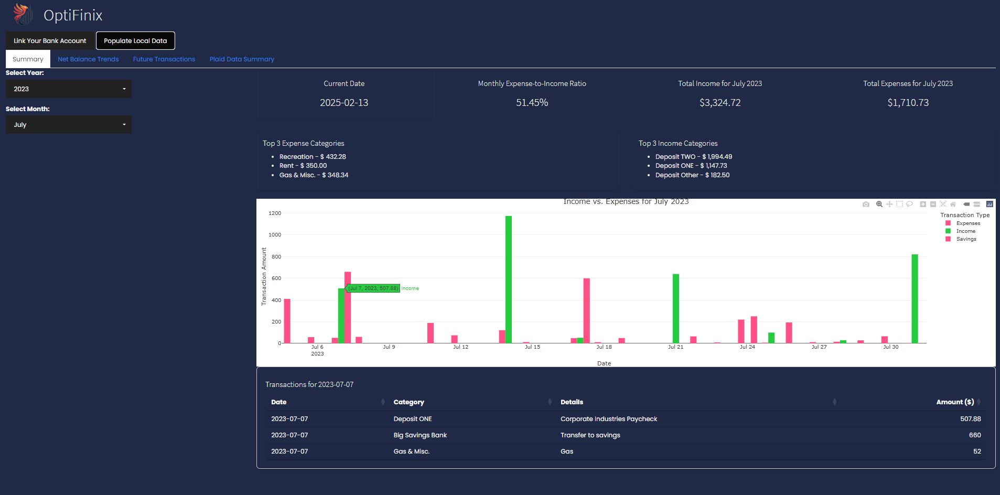
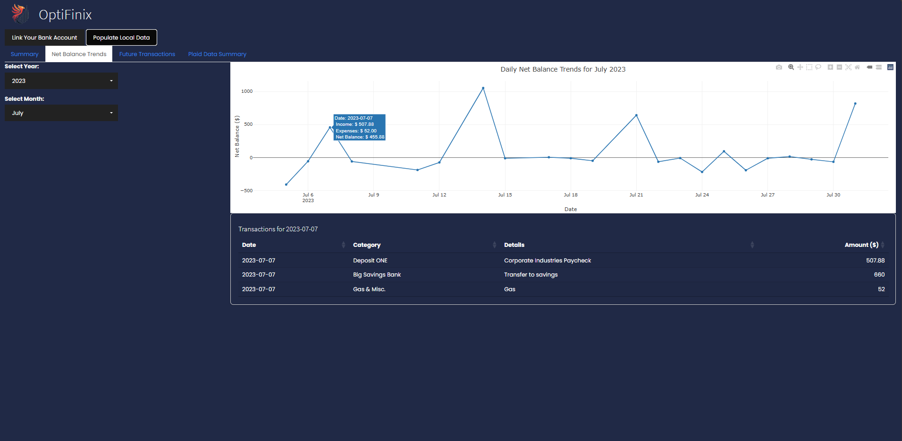
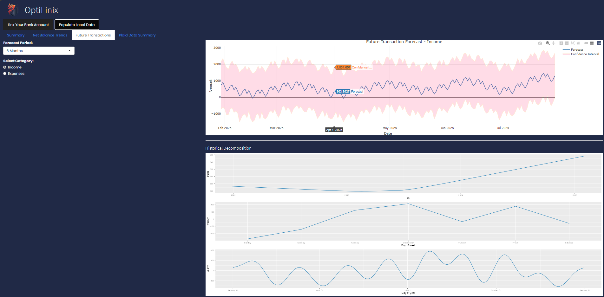
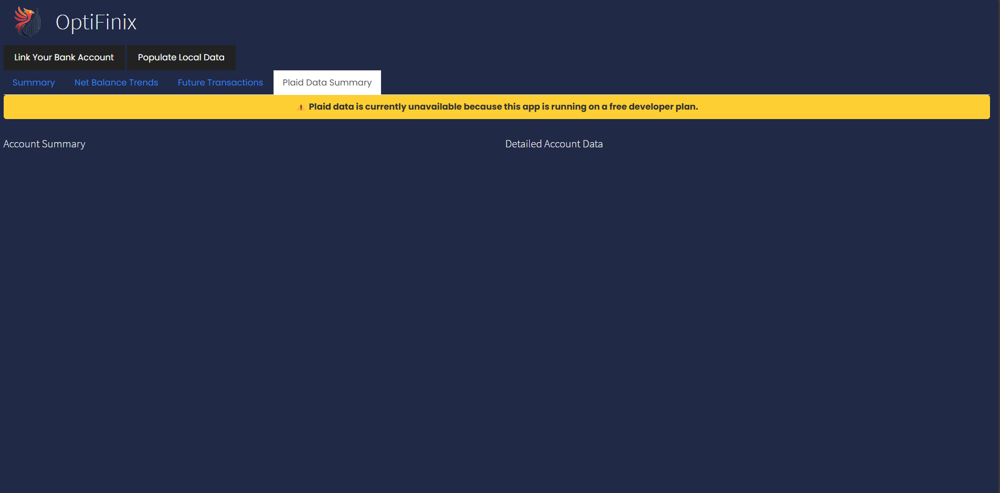

# OptiFinix: Personal Finance Analysis & Forecasting App

## Overview

OptiFinix is an interactive personal finance application designed to provide insights into income, expenses, and financial trends. Built using **R Shiny**, it integrates historical financial data with real-time account balances (via the Plaid API) and leverages time-series forecasting to predict future financial activity.

**Note:** The dataset used in this project is based on anonymized financial data, structured to reflect real-life financial patterns while ensuring privacy.

## Features

OptiFinix consists of four main modules:

### Summary Module
- Provides a snapshot of financial behavior for a selected month and year.
- Displays key metrics, including:
  - Total transactions recorded.
  - Average transaction amount.
  - The top three income and expense categories.
- Features an interactive **Income vs. Expenses** chart that allows users to drill down into daily transaction details.

#### Summary Tab

### Net Balance Trends Module
- Tracks daily net balance trends (income minus expenses) over time.
- Includes an interactive line chart to spot patterns in financial health.
- Clicking on any date reveals detailed transactions for that day.

#### Net Balance Trends Tab

### Future Transactions Module
- Uses **Prophet**, a time-series forecasting model, to predict income and expenses over the next 1, 3, or 6 months.
- Displays:
  - Forecasted values with confidence intervals.
  - Decomposition plots, breaking down trends into:
    - Overall trend direction.
    - Weekly spending habits.
    - Seasonal variations, such as increased expenses during the holidays.

#### Future Transactions Tab

### Plaid Data Summary Module
- Fetches real-time financial data using the **Plaid API** (currently using Sandbox data).
- Displays:
  - **Account Summary**: Total number of accounts and combined balances.
  - **Detailed Account Data**: Breakdown of individual accounts, including checking, savings, and credit card balances.

#### Plaid Data Summary Tab

---

## Technical Details

### Technologies Used
- **R Shiny** for building the interactive web application.
- **Prophet** for time-series forecasting.
- **Plotly** for interactive data visualizations.
- **Plaid API** for real-time financial data integration.
- **DT package** for rendering financial tables.
